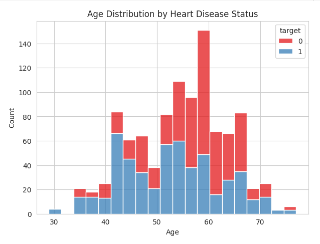

# Task 5 – Decision Trees & Random Forests | Elevate Labs Internship

## 📌 Objective
This project focuses on predicting heart disease presence using two classification models — **Decision Tree** and **Random Forest**.  
The goal is to compare their performance and understand the strengths of ensemble learning.

---

## 📁 Dataset
- [Heart Disease – Kaggle](https://www.kaggle.com/datasets/johnsmith88/heart-disease-dataset)

---

## 🔧 Steps Performed
- **Data Overview:** Checked dataset shape, info, and summary statistics.
- **EDA (Exploratory Data Analysis):**
  - Class distribution of target variable
  - Correlation heatmap for feature relationships
  - Age distribution by disease status
  - Max heart rate comparison by disease status
- **Model Training:**
  - Decision Tree Classifier
  - Random Forest Classifier
- **Evaluation:**
  - Accuracy score
  - Classification report
  - Confusion matrix
  - Accuracy comparison chart

---

## 📊 Key Observations
- Dataset is **balanced**, ensuring fair model evaluation.
- Chest pain type (`cp`), max heart rate (`thalach`), and exercise-induced angina (`exang`) are strongly correlated with the target.
- Decision Tree achieved **98.5% accuracy**.
- Random Forest achieved **100% accuracy** on the test set.

---

## 📈 Visuals

 
 
 
 

 
 

---

## ✨ Going the Extra Mile
Alongside the required steps, I included:
- Multiple EDA visualizations to understand patterns.
- Feature correlation analysis for model insight.
- Detailed markdown observations for each plot and output.

---

## 🙋‍♀️ About Me
I'm **Jaaie**, an IT graduate currently reskilling through Elevate Labs' AI/ML internship.  
My focus is on mastering both theoretical and hands-on skills for industry-standard ML workflows.

---

## 🔗 Submission
This project is submitted as part of the **Elevate Labs AI/ML Internship – Task 5**.
